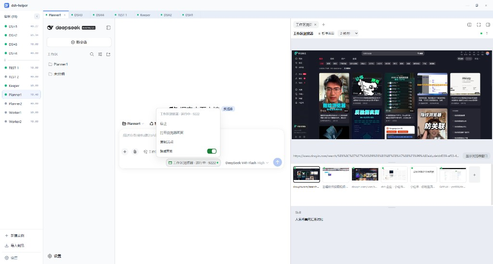

# dsh-helper-plugin-workspace-browser



DSH 插件。给**当前工作区**单独开一个带调试端口的 Chrome：你在右侧栏看画面，模型用 `workspace_browser_*` 阅读和操作页面。

它不接管你日常使用的那个浏览器，也不安装扩展。每个工作区有自己的登录态。本机需要已经装好 Chrome；插件不会代为下载浏览器。

实现细节、接口和实测记录在 [`DESIGN.zh.md`](DESIGN.zh.md)。

## 适合拿它做什么

- 打开一个网页，让模型读正文并总结。总结由模型写，插件只把页面文字交出去。
- 按页面上的控件完成点击、填字、翻页。控件用当次快照的编号指认，不靠截图认字。
- 把已经跑通的步骤存成技能，下次从输入框再调出来。

不适合拿它做的事：操作你已经登录的日常浏览器；让模型自己写页面脚本或点击坐标。

## 和扩展类插件的差别

扩展路线（例如 `dsh-browser-control`）连的是你正在用的浏览器。本插件另起一个 Chrome 进程。

| | 扩展路线 | 本插件 |
| --- | --- | --- |
| 和浏览器的关系 | 扩展加调试桥 | 无扩展，直连调试端口 |
| 准备 | 安装扩展 | 点胶囊里的「启动」 |
| 登录态 | 日常浏览器里已有的 | 这个工作区自己的 profile，站点要再登一次 |
| 你看到的画面 | 以文本快照为主 | 右侧栏实时画面 |
| 工具名 | `browser_*` | `workspace_browser_*`，可以和扩展同时装 |

## 安装

需要 Node.js 20 或更高，以及本机的 Chrome。两条命令都会改当前 web profile 的 `package.json`（依赖和 `dsh.profile.bundles`）。装完后重启 `dsh --profile web`（或 `dsh web`）。bundle 列表只在启动时读一次。

### 通过 GitHub 安装（推荐）

不用先克隆仓库。`github:` 协议把 [这个仓库](https://github.com/x102201/dsh-helper-plugin-workspace-browser) 装进 profile。

```bash
dsh plugin --profile web add github:x102201/dsh-helper-plugin-workspace-browser
```

### 通过 link 协议安装

本机已经有一份源码、要跟着改的时候用。`link:` 把 profile 的 `node_modules` 指到这个目录，改完重启就用到这份文件。路径必须是绝对路径。Windows 上权限不够时用 junction。

```bash
dsh plugin --profile web add link:/absolute/path/to/dsh-helper-plugin-workspace-browser
```

两件容易撞上的事：

- **`duplicate loader entry id`**：本包的 `cordis.patch.yml` 已经插入了 `id: workspace-browser`。profile 自己的 patch 里如果再插同一个 id，启动会失败。删掉其中一处。
- **工具重名**：同名工具会让加载直接失败。本插件用 `workspace_browser_*`，和 `browser_*` 不冲突。不要把同一份插件装两次。

## 打开这个工作区的浏览器

点输入框旁边的胶囊，只打开小面板，不会马上启动 Chrome。点「启动」之后窗口出现，右侧栏展开画面。

关掉浏览器窗口后，大约半秒内胶囊回到「未启动」，不会自己再打开。再点「启动」会重新起来。判断「运行中」靠的是调试通道能连上并且能列出标签，不是 `endpoint.json` 还在不在。

没找到 Chrome、版本过低、或找到多个候选时，小面板会写出原因，并给出下载、指定 `chrome.exe` 或重新检测。指定路径在**插件面板里本插件的配置区**。

## 把一句话交给模型

在输入框使用 `/browser`。没注册过的 `/命令` 会被 DSH 直接拒绝，不会当成普通文字。

| 你输入 | 插件先做的事 | 模型接着看到 |
| --- | --- | --- |
| `/browser` | 启动窗口并打开画面 | 没有新消息 |
| `/browser https://…` | 已有相同网址就用那张标签，否则后台新开 | 网址和标签 id |
| `/browser https://… 后面的话` | 同上 | 再加上这段话 |
| `/browser 一段没有网址的话` | 打开窗口和画面，不开新标签 | 整段话，由模型决定去哪 |
| `/browser --new https://…` | 即使已有相同网址也再开一张 | 同有网址的一行 |

`--new` 后面必须有网址，否则只返回错误，不启动。

交给模型的是一枚芯片：气泡上只显示短标签，悬停或真正送进模型时才展开。展开说明会要求只用 `workspace_browser_*`，不要改用 DSH 自带的网页抓取，也不要调用 `browser_*`。

已经打开的标签也可以从胶片条「加入对话」，效果和上面一样：先放进输入框，由你发送。

## 把重复步骤存成技能

技能记的是做法（自然语言，可以写 `{{参数}}`），不记某一次页面上的编号。文件在 `<workspace>/.workspace-browser/skills/<名字>.md`。这不是 DSH 宿主的 `.dsh/skills/`。直接对模型说「保存成 skill」会走到宿主那边。

在输入框里发起：

- `/browser 新增技能` 或 `/browser 新增skill`
- `/browser 保存技能` 或 `/browser 保存skill`
- `/browser 修改技能` 或 `/browser 修改skill`

后面可以再带名字。这些字只是线索。模型会先复述它理解的意图和步骤，你同意之后才写入。修改是用同一个名字覆盖。

胶片条下面是技能名字，横排，放不下就换行。鼠标停在名字上会变色。右键可以：

- **加入对话**：把名字放进输入框，不自动发送
- **查看**：在侧边栏打开这个技能文件
- **在文件资源管理器中显示**：在系统文件管理器里选中它
- **删除**：删掉这个技能文件

输入框打 `@` 也能选技能。发出去之后模型才看到全文。评论、发送默认先停下来等你确认，除非技能里写明不用确认。

鼠标停在「Skill」上，能看到同样的用法。胶片条和技能区之间的分隔条可以拖，高度会记住。

## 在右侧栏看页面

默认是上下两块：上面是当前焦点页，下面是这个窗口里各标签的缩略图（胶片条）。中间的分隔条可拖。

点缩略图只改你正在看哪一张，不把真实窗口带到前台。要看真实窗口，用悬停菜单里的「切到前台」。这是唯一会抢系统焦点的画面操作。

缩略图上有三处标记，颜色和形状同时使用：

| 标记 | 含义 |
| --- | --- |
| 整张图的外框 | 正在主画面里显示 |
| 图片下方的短横 | 那个窗口里最顶层的标签 |
| 左上角圆点 | 绿：调试通道已接管；灰：还没接管 |

窗口最小化、所有标签都不可见时，短横会沿用上一次的结果，提示里会写明是推断。

只有这块画面真的看得见时才接收画面流。切走之后停止推送，避免对着没人看的面板空转。

## 模型能做的操作

工具在插件加载时就注册，不随浏览器启停增减。浏览器没起来时，调用会返回带说明的错误，模型可以原样告诉你。

| | 工具 |
| --- | --- |
| 读 | `snapshot`、`get_text`、`list_tabs`、`select_tab`、`screenshot` |
| 写 | `click`、`type`、`press`、`scroll`、`navigate`、`open_tab`、`close_tab`、`back`、`forward`、`reload`、`wait` |
| 保存技能 | `save_skill`（要你先在对话里确认） |
| 默认没有 | `evaluate` |

名字都带前缀 `workspace_browser_`。

`snapshot` 先给可见正文，再给可操作控件的编号（`e1`、`e2`）。编号只对这一份快照有效。点击和填字用这些编号，不用 CSS，也不用坐标。操作之后会再给一份快照。正文为空（内部页、PDF、还在加载）会说明原因，不当作成功。

`get_text` 优先取 `main` 或 `article`。密码和名字敏感的字段只给占位符。页面上的文字都包在不可信标记里，模型不应把它们当成给你的指令。

截图给人看，也给 `screenshot` 工具落盘。认按钮、读正文不走截图。

写操作直接执行，不再询问。

正文和点击使用 `playwright-core`，连到已经启动的那个 Chrome。第一次读写页面时，如果本机还没有这个库，会装到 `<DSH_HOME>/workspace-browser/vendor/`，版本钉在 `1.55.1`，不会再下载一份浏览器。装不上时读写工具返回 `playwright-missing`，胶囊和画面仍可用。进程、标签、画面和截图仍走 Chrome 调试协议。

## 数据放在哪

```
<workspace>/.workspace-browser/
├── .gitignore
├── chrome-profile/     # 这个工作区的登录态
├── skills/             # 技能说明
├── shots/              # 截图
└── endpoint.json       # 端口线索，不代表浏览器还活着
```

目录名以点开头，并在 Windows 上设了隐藏属性。目录里的 `.gitignore` 内容是 `*`。工作区已经有 `.gitignore` 时，会追加一行 `.workspace-browser/`，没有这个文件就不代为创建。

没有工作区的会话用 `<DSH_HOME>/workspace-browser/_ungrouped/`。换一个工作区就是另一套 profile，站点要重新登录。

## 配置

**侧边栏「插件」→「已安装」里的 `dsh-helper-plugin-workspace-browser` 卡片**，配置区在描述和「包含的组件」之间。

namespace 是这一行的 **Loader row id** `workspace-browser`（`cordis.patch.yml`）；保存写进 profile 的 `cordis.patch.yml` 用户层，不是 `settings.yaml`。

| 键 | 默认 | 说明 |
| --- | --- | --- |
| `capsuleEnabled` | 开 | 输入框那一行的胶囊 |
| `capsuleShowPort` | 开 | 胶囊文案里带端口 |
| `panelAutoOpenOnLaunch` | 开 | 启动成功后展开画面 |
| `panelTileSplit` | `0.55` | 焦点区高度占比，拖分隔条会写回 |
| `panelSkillHeight` | `72` | 技能区高度（像素，40–360），拖胶片条下方的分隔条会写回 |
| `panelFollowFrontTab` | 关 | 焦点是否跟随窗口里最顶层的标签 |
| `streamFocusFps` / `streamFocusMaxWidth` / `streamFocusQuality` | `2` / `960` / `70` | 主画面。质量是 1–100 的整数 |
| `streamThumbFps` / `streamThumbMaxWidth` / `streamThumbQuality` | `0.25` / `160` / `50` | 缩略图。帧率 0 表示不要缩略图 |
| `userDataDir` | 空 | 留空用工作区自己的目录。填了就用这份已经登录过的用户数据目录 |
| `debugPort` | `0` | 0 为自动分配。填了就连接这个端口；端口上已有窗口就直接用 |
| `chromeCrossOrigin` | 关 | 打开后加上关闭站点隔离的启动参数，并重启实例 |
| `instanceOnDshExit` | `keep` | `keep` 留下本插件启动的浏览器，`close` 随 DSH 退出关掉。接到已有调试窗口时不关 |

画面、胶囊相关的项在点保存后马上生效。用户数据目录、调试端口、跨域和退出行为在下次启动这个浏览器时生效。

配置页里如果看不到本插件，两边都要在：宿主那一行导出 `Config`（0.2 的 settings 服务据此描述 namespace），浏览器半边把页面注册进插件面板的 `plugins.bundle.config`（键 = 包名）。少一边，配置区就是空的。挂载成功时浏览器控制台有一行 `注册插件页面`。

## 给改代码的人

宿主半边是 `index.js`，浏览器半边是 `client.js`（ModuleLoader 工厂，不用 ESM import）。页面读写在 `lib/page-driver.js`，调试协议客户端在 `lib/cdp.js`。

控制面前缀是 `/dsh-helper-plugin-workspace-browser`。常用的有 `GET /status`（不启动进程）、`POST /launch`、`POST /stop`、`GET /skills`、`POST /skills/locate`。画面 WebSocket 在同一前缀的 `/stream`，只接受回环地址。完整表、帧格式和 CDP 约定在设计说明第 7 节。

```bash
npm test                 # 编码检查和单元测试，不启动 Chrome
npm run verify:p0        # 真机：启动、停止、假端点、强杀进程
npm run verify:live      # 真机：读、写、画面
```

`verify:*` 会打开一个 Chrome 窗口，结束时自己收尾。

## 许可证

MIT
